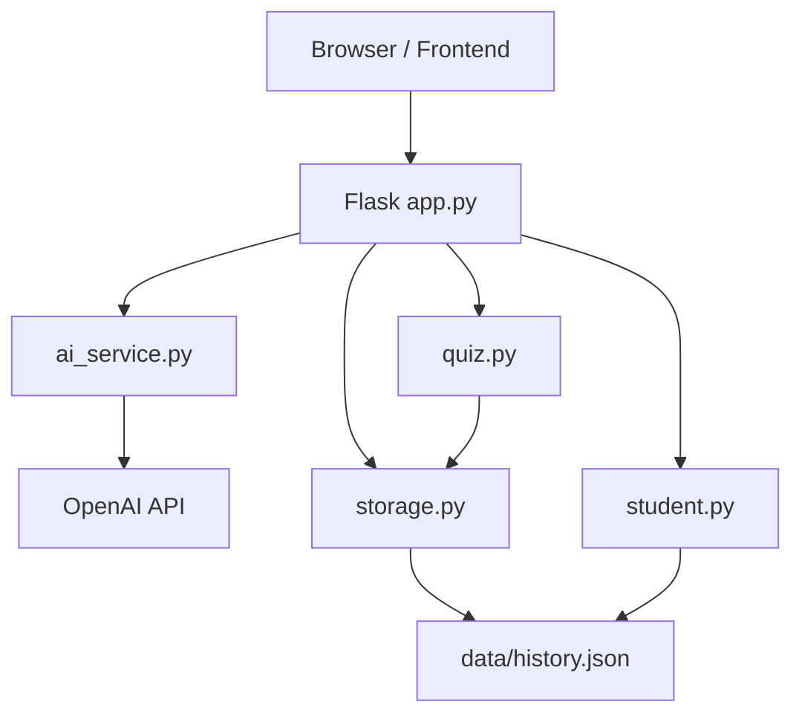
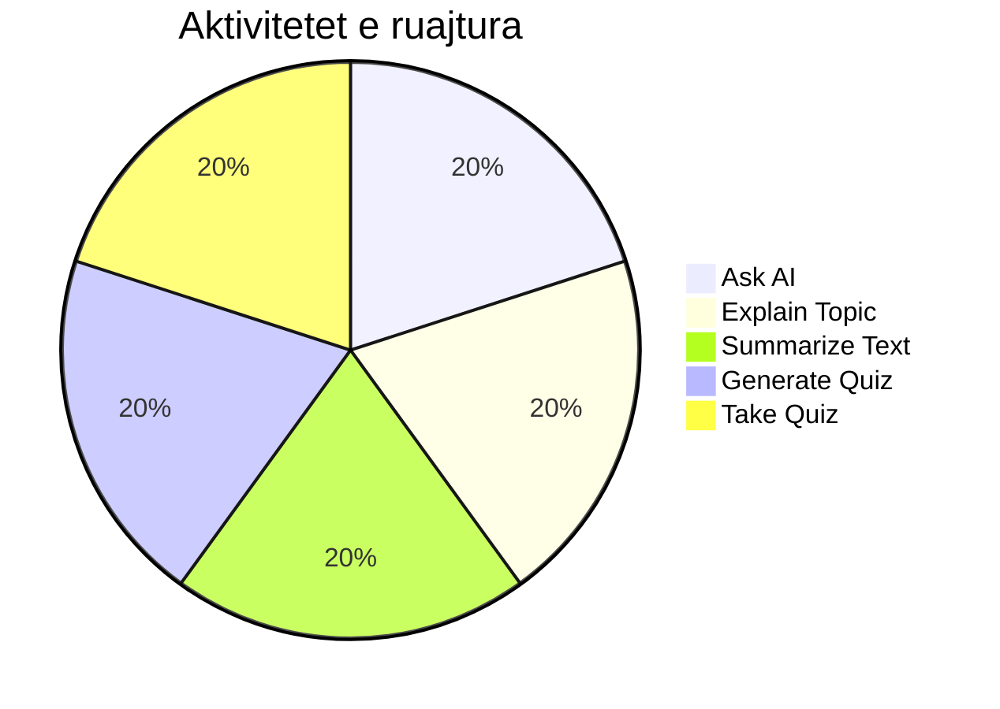

# CampusMate AI

CampusMate AI eshte nje web-aplikacion per mesim me ndihmen e inteligjences artificiale. Studenti mund te beje pyetje, te kerkoje shpjegime, te permbledhe tekst, te gjeneroje kuize dhe te analizoje aktivitetin e tij mesimor.

Frontend-i perdor HTML, CSS dhe JavaScript Vanilla. Backend-i perdor Flask, Python, OpenAI API dhe JSON per ruajtje persistente te historikut.

## Qellimi

CampusMate AI synon ta beje mesimin me te organizuar duke kombinuar asistencen AI me funksione praktike per ushtrime dhe ndjekje te progresit.

| Funksionaliteti | Pershkrimi |
| --- | --- |
| Ask AI a Question | Pergjigje edukative per pyetjet e studentit |
| Explain a Topic | Shpjegim i nje teme sipas nivelit Beginner, Intermediate ose Advanced |
| Summarize Text | Permbledhje Short, Detailed, Bullet Points ose Beginner Friendly |
| Generate Quiz | Gjenerim kuizi me pyetje multiple-choice |
| Take Quiz | Zgjedhje pergjigjesh dhe dorezim per vleresim |
| View Previous Questions | Shfaqje e aktiviteteve te ruajtura ne historik |
| View Statistics | Statistika te llogaritura nga te dhenat reale |

## Teknologjite

| Teknologjia | Perdorimi |
| --- | --- |
| Python | Logjika e backend-it, ruajtja dhe scoring-u |
| Flask | API routes dhe sherbimi i frontend-it |
| Flask-CORS | Komunikimi frontend-backend gjate zhvillimit |
| OpenAI Python SDK | Pergjigje, shpjegime, permbledhje dhe kuize |
| `gpt-4o-mini` | Modeli i perdorur nga sherbimi AI |
| HTML/CSS | Strukturimi dhe dizajni i aplikacionit |
| JavaScript Vanilla | Interaktiviteti dhe komunikimi me API |
| JSON | Ruajtja persistente e historikut |
| `python-dotenv` | Leximi i `OPENAI_API_KEY` nga `.env` |

## Arkitektura



Rrjedha kryesore:

```text
Frontend JavaScript
				|
				v
Flask API ne backend/app.py
				|
				+--> ai_service.py --> OpenAI API
				|
				+--> quiz.py      --> scoring Python
				|
				+--> storage.py   --> data/history.json
				|
				+--> student.py   --> statistika reale
```

## Struktura e projektit

```text
CampusMate-AI/
|-- backend/
|   |-- app.py
|   |-- ai_service.py
|   |-- quiz.py
|   |-- student.py
|   `-- storage.py
|-- data/
|   `-- history.json
|-- frontend/
|   |-- index.html                 # Ask AI a Question
|   |-- pages/
|   |   |-- explain.html
|   |   |-- summarize.html
|   |   |-- generate-quiz.html
|   |   |-- take-quiz.html
|   |   |-- history.html
|   |   `-- statistics.html
|   |-- components/
|   |   |-- sidebar.html
|   |   `-- header.html
|   |-- css/
|   |   |-- style.css
|   |   |-- sidebar.css
|   |   |-- components.css
|   |   `-- responsive.css
|   `-- js/
|       |-- main.js                # Ask AI JavaScript
|       |-- navigation.js
|       |-- explain.js
|       |-- summarize.js
|       |-- generate-quiz.js
|       |-- take-quiz.js
|       |-- history.js
|       `-- statistics.js
|-- .env
|-- .gitignore
|-- requirements.txt
`-- README.md
```

Ask AI perdor `frontend/index.html` dhe `frontend/js/main.js`. Nuk perdoren `ask.html` ose `ask.js` si skedare kanonike.

## Parakushtet

Instalo:

| Programi | Versioni |
| --- | --- |
| Python | 3.10 ose me i ri |
| pip | Versioni i perfshire me Python |
| OpenAI API key | Nevojitet vetem per funksionet AI |

## Instalimi

### 1. Klonimi

```powershell
git clone <repository-url>
cd CampusMate-AI
```

### 2. Krijimi i virtual environment ne Windows

```powershell
python -m venv .venv
.venv\Scripts\Activate.ps1
```

Nese PowerShell bllokon aktivizimin per sesionin aktual:

```powershell
Set-ExecutionPolicy -Scope Process -ExecutionPolicy RemoteSigned
.venv\Scripts\Activate.ps1
```

### 3. Instalimi i dependencies

```powershell
pip install -r requirements.txt
```

### 4. Konfigurimi i `.env`

Krijo ose kontrollo `.env` ne root te projektit:

```env
OPENAI_API_KEY=your-openai-api-key
```

Mos e vendos API key ne HTML, CSS, JavaScript, `history.json` ose README. Mos e commit-o `.env` me kredenciale reale.

## Ekzekutimi

Nise aplikacionin nga root-i i projektit:

```powershell
python backend/app.py
```

Hape ne browser:

```text
http://127.0.0.1:5000/
```

Flask sherben automatikisht frontend-in dhe assets:

| URL | Burimi |
| --- | --- |
| `/` | `frontend/index.html` |
| `/css/<filename>` | `frontend/css/` |
| `/js/<filename>` | `frontend/js/` |
| `/pages/<filename>` | `frontend/pages/` |
| `/components/<filename>` | `frontend/components/` |

## API endpoints

| Metoda | Endpoint | Qellimi |
| --- | --- | --- |
| `GET` | `/api/health` | Kontrollon nese backend-i eshte aktiv |
| `POST` | `/api/ask` | Pergjigjet ne pyetje dhe ruan historikun |
| `POST` | `/api/explain` | Shpjegon teme sipas difficulty |
| `POST` | `/api/summarize` | Permbledh tekst sipas style |
| `POST` | `/api/generate-quiz` | Gjeneron kuiz multiple-choice dhe ruan aktivitetin |
| `POST` | `/api/submit-quiz` | Ben scoring ne Python dhe ruan perfundimin |
| `GET` | `/api/history` | Kthen aktivitetet e ruajtura |
| `GET` | `/api/statistics` | Kthen statistikat e llogaritura |

Shembull kerkese:

```javascript
fetch("/api/ask", {
	method: "POST",
	headers: { "Content-Type": "application/json" },
	body: JSON.stringify({ question: "What is RAM?" })
});
```

Frontend-i komunikon vetem me Flask. OpenAI thirret vetem nga `backend/ai_service.py`.

## Funksionalitetet kryesore

### Ask AI

Studenti shkruan pyetje ne textarea dhe merr pergjigje edukative. Pas suksesit ruhen pyetja, pergjigjja dhe timestamp-i ne `data/history.json`.

### Explain a Topic

Studenti zgjedh temen dhe nivelin:

- `beginner`
- `intermediate`
- `advanced`

Backend-i dergon prompt-in perkates te OpenAI dhe ruan shpjegimin e suksesshem ne historik.

### Summarize Text

Stilet e mbeshtetura jane:

- `short`
- `detailed`
- `bullet_points`
- `beginner_friendly`

Permbledhja ruhet pas pergjigjes se suksesshme.

### Generate Quiz

Gjeneron pyetje me strukture:

```json
{
	"questions": [
		{
			"question": "...",
			"options": ["...", "...", "...", "..."],
			"correct_answer": "...",
			"explanation": "..."
		}
	]
}
```

Quiz-i ruhet ne frontend per kalimin te Take Quiz, ndërsa aktiviteti i gjenerimit ruhet ne historik nga backend-i.

### Take Quiz dhe scoring

Studenti zgjedh pergjigjet dhe ne pyetjen e fundit shtyp `Finish Quiz`. Frontend-i dergon quiz-in dhe answers te `/api/submit-quiz`. Python:

1. Kontrollon pyetjet dhe opsionet.
2. Krahason pergjigjet me `correct_answer`.
3. Numeron `correct` dhe `incorrect`.
4. Llogarit `score` ne perqindje.
5. E ruan perfundimin e kuizit.

OpenAI nuk ben scoring.

### View Previous Questions

Faqja therrit `/api/history` dhe shfaq records reale nga JSON. Mbeshtehen kerkimet, filtrimi sipas tipit, filtrimi sipas dates, preview dhe empty state.

### View Statistics

Faqja therrit `/api/statistics`. `Student` llogarit:

- pyetjet Ask AI
- kuizet e perfunduara
- pergjigjet korrekte
- pergjigjet jokorrekte
- mesataren e scores
- performancen e kuizeve

## Ruajtja persistente

`backend/storage.py` perdor `pathlib` dhe `json` per `data/history.json`.

Funksionet kryesore:

| Funksioni | Pergjegjesia |
| --- | --- |
| `load_history()` | Lexon records dhe rikuperon nga file mungues ose JSON i prishur |
| `save_history(history)` | Ruaj records ne JSON dhe krijon folderin kur duhet |
| `add_history_entry(entry)` | Shton record te ri me timestamp UTC |
| `get_history()` | Kthen historikun aktual |

Formatet kryesore:

```json
{
	"type": "ask",
	"question": "What is a compiler?",
	"answer": "...",
	"timestamp": "2026-09-04T17:00:00+00:00"
}
```

```json
{
	"type": "explain",
	"topic": "Object-Oriented Programming",
	"difficulty": "beginner",
	"explanation": "...",
	"timestamp": "2026-09-04T17:01:00+00:00"
}
```

```json
{
	"type": "quiz_completed",
	"topic": "Python",
	"difficulty": "intermediate",
	"total_questions": 5,
	"answered": 5,
	"correct": 4,
	"incorrect": 1,
	"score": 80,
	"timestamp": "2026-09-04T17:05:00+00:00"
}
```

Records shtohen, nuk zëvendësojnë historikun ekzistues. Nëse file mungon, krijohet automatikisht. Nëse JSON eshte malformed, aplikacioni vazhdon me histori bosh.

## Vizualizimet dhe tabelat

### Tabela e historikut

Faqja View Previous Questions shfaq aktivitetet me tipin, pyetjen/temen, daten, oren dhe score kur ekziston.

### Questions by Type

Statistics perdor nje donut chart SVG. Segmentet llogariten nga counts reale te ruajtura, jo nga perqindje te hardcoded.



Ky diagram eshte ilustrues per dokumentim; chart-i ne aplikacion perdor te dhenat reale nga `/api/statistics`.

### Quiz Performance

Score ring dhe rows per Passed, Average dhe Failed llogariten nga scores e kuizeve te perfunduara. Kur nuk ka kuize, te gjitha vlerat jane zero.

## Testimi

Kontrolli baze i backend-it:

```powershell
python backend/app.py
```

Health check:

```powershell
Invoke-WebRequest http://127.0.0.1:5000/api/health
```

Per te kontrolluar persistence:

1. Nise Flask.
2. Bej nje pyetje Ask AI.
3. Kontrollo `data/history.json` ose View Previous Questions.
4. Ndale Flask.
5. Nise perseri.
6. Kontrollo qe record-i dhe statistikat jane ende aty.

Testet e implementuara gjate zhvillimit mbulojne:

- ruajtjen e Ask AI, Explain, Summarize dhe Quiz records
- scoring Python per correct/incorrect/score
- historikun pas ngarkimit ne proces te ri Python
- JSON mungues ose malformed
- zero statistics kur nuk ka data
- syntax validation per Python dhe JavaScript

## Siguria dhe kufizimet

- API key lexohet vetem nga `.env` ne backend.
- Frontend-i nuk komunikon direkt me OpenAI.
- Nuk ruhen passwords ose te dhena sensitive.
- Error messages nuk ekspozojne stack traces ose filesystem paths.
- CORS eshte aktivizuar per zhvillim lokal.
- Scoring kontrollohet nga Python, jo nga AI ose vetem nga JavaScript.

## Gjendja aktuale

Te plota:

- Shtate faqet kryesore te frontend-it
- Flask asset serving
- Katër integrime AI
- Quiz generation dhe Python scoring
- History persistence ne JSON
- History API dhe UI
- Statistics API dhe charts me data reale

Me vone mund te shtohen autentikimi, database me shume perdorues, teste me pytest dhe nje storage me robust per prodhim.
